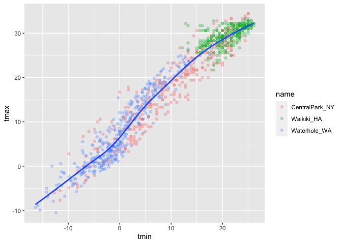
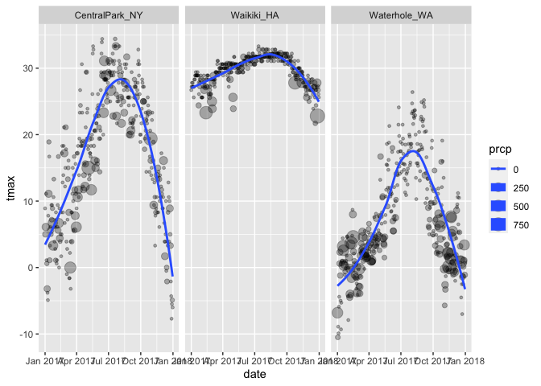

Viz and EDA
================
Anna Ma
Oct 05 2021

## GG plot

``` r
library(tidyverse)
```

    ## ── Attaching packages ─────────────────────────────────────── tidyverse 1.3.1 ──

    ## ✓ ggplot2 3.3.5     ✓ purrr   0.3.4
    ## ✓ tibble  3.1.4     ✓ dplyr   1.0.7
    ## ✓ tidyr   1.1.3     ✓ stringr 1.4.0
    ## ✓ readr   2.0.1     ✓ forcats 0.5.1

    ## ── Conflicts ────────────────────────────────────────── tidyverse_conflicts() ──
    ## x dplyr::filter() masks stats::filter()
    ## x dplyr::lag()    masks stats::lag()

``` r
library(ggridges)
```

load a data set that we use the most

``` r
weather_df = 
  rnoaa::meteo_pull_monitors(
    c("USW00094728", "USC00519397", "USS0023B17S"),
    var = c("PRCP", "TMIN", "TMAX"), 
    date_min = "2017-01-01",
    date_max = "2017-12-31") %>%
  mutate(
    name = recode(
      id, 
      USW00094728 = "CentralPark_NY", 
      USC00519397 = "Waikiki_HA",
      USS0023B17S = "Waterhole_WA"),
    tmin = tmin / 10,
    tmax = tmax / 10) %>%
  select(name, id, everything())
```

    ## Registered S3 method overwritten by 'hoardr':
    ##   method           from
    ##   print.cache_info httr

    ## using cached file: ~/Library/Caches/R/noaa_ghcnd/USW00094728.dly

    ## date created (size, mb): 2021-10-05 10:29:41 (7.602)

    ## file min/max dates: 1869-01-01 / 2021-10-31

    ## using cached file: ~/Library/Caches/R/noaa_ghcnd/USC00519397.dly

    ## date created (size, mb): 2021-10-05 10:29:46 (1.697)

    ## file min/max dates: 1965-01-01 / 2020-02-29

    ## using cached file: ~/Library/Caches/R/noaa_ghcnd/USS0023B17S.dly

    ## date created (size, mb): 2021-10-05 10:29:49 (0.912)

    ## file min/max dates: 1999-09-01 / 2021-09-30

## Let’s make some plots!

### Scaterplot

tmax vs. tmin

``` r
weather_df %>% 
  ggplot(aes(x = tmin, y = tmax)) + 
  # tell what varaible to map on the plot 
  geom_point()
```

    ## Warning: Removed 15 rows containing missing values (geom_point).

<!-- -->

save ggplot

``` r
ggp_tmax_tmin = 
  weather_df %>% 
  ggplot(aes(x = tmin, y = tmax)) + 
  # tell what varaible to map on the plot 
  geom_point()

ggp_tmax_tmin
```

    ## Warning: Removed 15 rows containing missing values (geom_point).

<!-- -->

``` r
# can use ggsave() here 
```

### LET’S FANCY IT UP

add color? lines?

``` r
weather_df %>% 
  ggplot(aes(x = tmin, y = tmax, color = name)) + 
  # tell what varaible to map on the plot 
  geom_point(alpha = 0.3) +
  geom_smooth(se = FALSE) + 
  # it's har to see the lines, so we can use other arguments
  facet_grid(.~ name)
```

    ## `geom_smooth()` using method = 'loess' and formula 'y ~ x'

    ## Warning: Removed 15 rows containing non-finite values (stat_smooth).

    ## Warning: Removed 15 rows containing missing values (geom_point).

<!-- -->

``` r
  #Using the dot because ...?  
```

``` r
weather_df %>% 
  ggplot(aes(x = tmin, y = tmax)) + 
  # tell what varaible to map on the plot 
  geom_point(alpha = 0.3, aes(color = name)) +
  # shifted the aes from global to only the points 
  geom_smooth(se = FALSE)
```

    ## `geom_smooth()` using method = 'gam' and formula 'y ~ s(x, bs = "cs")'

    ## Warning: Removed 15 rows containing non-finite values (stat_smooth).

    ## Warning: Removed 15 rows containing missing values (geom_point).

<!-- -->

make one more scatter plot

``` r
weather_df %>% 
  ggplot(aes(x = date, y = tmax, size = prcp)) + 
  geom_point(alpha = 0.3) +
  geom_smooth(se = FALSE) +
  facet_grid(. ~ name)
```

    ## `geom_smooth()` using method = 'loess' and formula 'y ~ x'

    ## Warning: Removed 3 rows containing non-finite values (stat_smooth).

    ## Warning: Removed 3 rows containing missing values (geom_point).

<!-- -->
