2021\_10\_07\_lecture
================
Anna Ma
10/10/2021

``` r
library(tidyverse)
```

    ## ── Attaching packages ─────────────────────────────────────── tidyverse 1.3.1 ──

    ## ✓ ggplot2 3.3.5     ✓ purrr   0.3.4
    ## ✓ tibble  3.1.4     ✓ dplyr   1.0.7
    ## ✓ tidyr   1.1.3     ✓ stringr 1.4.0
    ## ✓ readr   2.0.1     ✓ forcats 0.5.1

    ## ── Conflicts ────────────────────────────────────────── tidyverse_conflicts() ──
    ## x dplyr::filter() masks stats::filter()
    ## x dplyr::lag()    masks stats::lag()

``` r
library(ggridges)
library(patchwork)
```

## Load the weather data set

``` r
weather_df = 
  rnoaa::meteo_pull_monitors(
    c("USW00094728", "USC00519397", "USS0023B17S"),
    var = c("PRCP", "TMIN", "TMAX"), 
    date_min = "2017-01-01",
    date_max = "2017-12-31") %>%
  mutate(
    name = recode(
      id, 
      USW00094728 = "CentralPark_NY", 
      USC00519397 = "Waikiki_HA",
      USS0023B17S = "Waterhole_WA"),
    tmin = tmin / 10,
    tmax = tmax / 10) %>%
  select(name, id, everything())
```

    ## Registered S3 method overwritten by 'hoardr':
    ##   method           from
    ##   print.cache_info httr

    ## using cached file: ~/Library/Caches/R/noaa_ghcnd/USW00094728.dly

    ## date created (size, mb): 2021-10-05 10:29:41 (7.602)

    ## file min/max dates: 1869-01-01 / 2021-10-31

    ## using cached file: ~/Library/Caches/R/noaa_ghcnd/USC00519397.dly

    ## date created (size, mb): 2021-10-05 10:29:46 (1.697)

    ## file min/max dates: 1965-01-01 / 2020-02-29

    ## using cached file: ~/Library/Caches/R/noaa_ghcnd/USS0023B17S.dly

    ## date created (size, mb): 2021-10-05 10:29:49 (0.912)

    ## file min/max dates: 1999-09-01 / 2021-09-30

``` r
weather_df
```

    ## # A tibble: 1,095 × 6
    ##    name           id          date        prcp  tmax  tmin
    ##    <chr>          <chr>       <date>     <dbl> <dbl> <dbl>
    ##  1 CentralPark_NY USW00094728 2017-01-01     0   8.9   4.4
    ##  2 CentralPark_NY USW00094728 2017-01-02    53   5     2.8
    ##  3 CentralPark_NY USW00094728 2017-01-03   147   6.1   3.9
    ##  4 CentralPark_NY USW00094728 2017-01-04     0  11.1   1.1
    ##  5 CentralPark_NY USW00094728 2017-01-05     0   1.1  -2.7
    ##  6 CentralPark_NY USW00094728 2017-01-06    13   0.6  -3.8
    ##  7 CentralPark_NY USW00094728 2017-01-07    81  -3.2  -6.6
    ##  8 CentralPark_NY USW00094728 2017-01-08     0  -3.8  -8.8
    ##  9 CentralPark_NY USW00094728 2017-01-09     0  -4.9  -9.9
    ## 10 CentralPark_NY USW00094728 2017-01-10     0   7.8  -6  
    ## # … with 1,085 more rows

## Plot from last lecture

``` r
weather_df %>% 
  ggplot(aes(x = tmin, y = tmax, color = name)) + 
  geom_point(alpha = .5)
```

    ## Warning: Removed 15 rows containing missing values (geom_point).

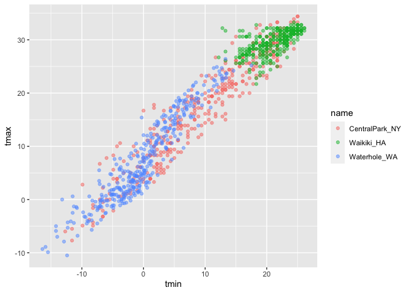<!-- -->

## Add Labels

``` r
weather_df %>% 
  ggplot(aes(x = tmin, y = tmax, color = name)) + 
  geom_point(alpha = .5) +
  labs(
    title = "Temperature Plot",
    x = "Minimum daily temperature(C)",
    y = "Maximum daily temperature(C)",
    caption = "Data from rnoaa package; temperature in 2017"
  )
```

    ## Warning: Removed 15 rows containing missing values (geom_point).

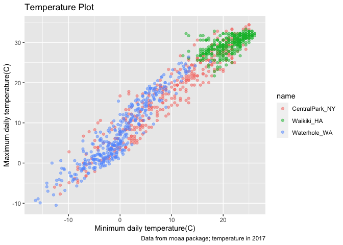<!-- -->

## Scales

aesthetic mapping tell you how a variable mapps onto some graph feature.
This happens in the background, but we still have some control when we
create the graph. Scales is going to control the behavior of things that
happen behind the scenes with the sesthetic mappings.

start with the same plot and define x and y scales

``` r
weather_df %>% 
  ggplot(aes(x = tmin, y = tmax, color = name)) + 
  geom_point(alpha = .5) +
  labs(
    title = "Temperature Plot",
    x = "Minimum daily temperature(C)",
    y = "Maximum daily temperature(C)",
    caption = "Data from rnoaa package; temperature in 2017"
  ) + 
  # the variable that maps to the x axis is continuous, so use the following 
  scale_x_continuous(
    breaks = c(-15,0,15), # suppose we didn't want -10,0,and 10
    labels = c("-15 C", "0 ","15")
  ) + 
  scale_y_continuous(
    #trans = "sqrt" # using the square root transformation
    position = "right" # put the scale on the right
  )
```

    ## Warning: Removed 15 rows containing missing values (geom_point).

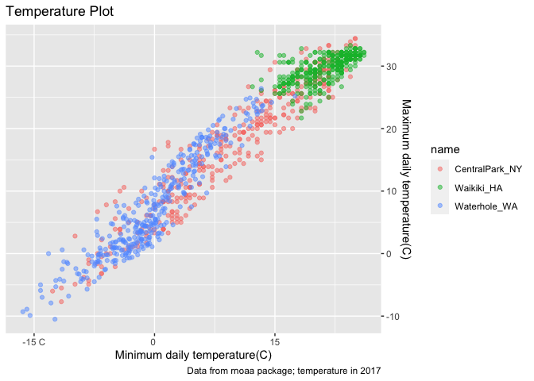<!-- -->

Look at the color scales

``` r
weather_df %>% 
  ggplot(aes(x = tmin, y = tmax, color = name)) + 
  geom_point(alpha = .5) +
  labs(
    title = "Temperature Plot",
    x = "Minimum daily temperature(C)",
    y = "Maximum daily temperature(C)",
    caption = "Data from rnoaa package; temperature in 2017"
  ) +
  scale_color_hue(
    # we can define something different for the name here
    # we update from the variable "name" to "location"
    name = "Location",
    h = c(100,300)) #h tells something about the hue of a scale, we can define our own color here
```

    ## Warning: Removed 15 rows containing missing values (geom_point).

<!-- -->

``` r
weather_df %>% 
  ggplot(aes(x = tmin, y = tmax, color = name)) + 
  geom_point(alpha = .5) +
  labs(
    title = "Temperature Plot",
    x = "Minimum daily temperature(C)",
    y = "Maximum daily temperature(C)",
    caption = "Data from rnoaa package; temperature in 2017"
  ) +
  # if u don't like what the usual default ggplot color, and not good at define own color and design, this is the package u can use. we can look up the viridis package online 
  viridis::scale_color_viridis(
    name = "Location",
    discrete = TRUE) 
```

    ## Warning: Removed 15 rows containing missing values (geom_point).

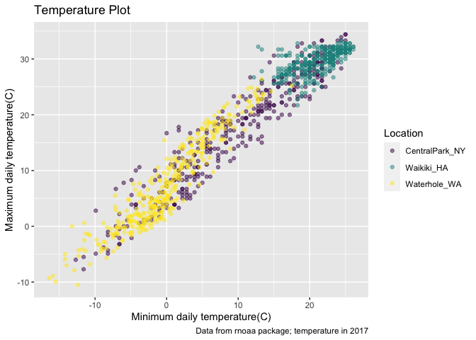<!-- -->

``` r
# here, name is a categorical predictor that has three levels, so the scale is discrete, therefore, we have to add discrete = TRUE.
```

## Themes

Plot features that are not data related

Shift the legend

``` r
weather_df %>% 
  ggplot(aes(x = tmin, y = tmax, color = name)) + 
  geom_point(alpha = .5) +
  labs(
    title = "Temperature Plot",
    x = "Minimum daily temperature(C)",
    y = "Maximum daily temperature(C)",
    caption = "Data from rnoaa package; temperature in 2017"
  ) +
  viridis::scale_color_viridis(
    name = "Location",
    discrete = TRUE) +
  theme(legend.position = "bottom")
```

    ## Warning: Removed 15 rows containing missing values (geom_point).

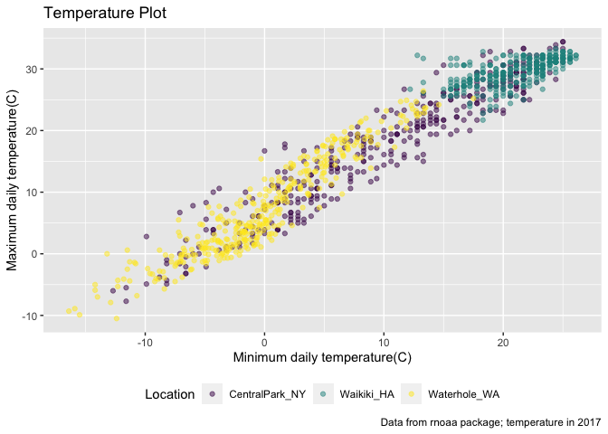<!-- -->

``` r
# there are a lot of other argument to control legend
```

change the overall theme: theme\_bw(), theme\_minimal(),
theme\_classic(), ggthemes::

``` r
weather_df %>% 
  ggplot(aes(x = tmin, y = tmax, color = name)) + 
  geom_point(alpha = .5) +
  labs(
    title = "Temperature Plot",
    x = "Minimum daily temperature(C)",
    y = "Maximum daily temperature(C)",
    caption = "Data from rnoaa package; temperature in 2017"
  ) +
  viridis::scale_color_viridis(
    name = "Location",
    discrete = TRUE) +
  theme_minimal() + # this is the overall theme, update at first, if update behind other theme() tweaks, this is going to override everything, if we want to use theme() to change things, put it below the overal theme, for example: 
  theme(legend.position = "bottom")
```

    ## Warning: Removed 15 rows containing missing values (geom_point).

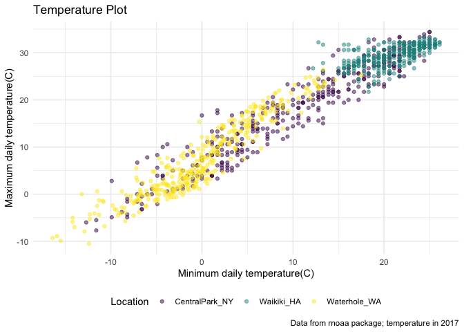<!-- -->

## Setting options

``` r
# put this chunk at the top of the code, then all the plot in the following document will use this theme

library(tidyverse)

knitr::opts_chunk$set(
  fig.width = 6,
  fig.asp = .6,
  out.width = "90%"
)

theme_set(theme_minimal()+ theme(legend.position = "bottom"))

options(
  ggplot2.continuous.colour = "viridis",
  ggplot2.continuous.fill = "viridis"
)

scale_color_discrete = scale_color_viridis_d
scale_fill_discrete = scale_fill_viridis_d
```

## Data args in geom()

``` r
central_park = 
  weather_df %>% 
  filter(name == "CentralPark_NY")

waikiki = 
  weather_df %>% 
  filter(name == "Waikiki_HA")

#assume that everything is from waikiki
ggplot(data = waikiki, aes(x = date, y = tmax, color = name)) + 
  geom_point() + 
  geom_line()#from left to right connect the dots
```

    ## Warning: Removed 3 rows containing missing values (geom_point).

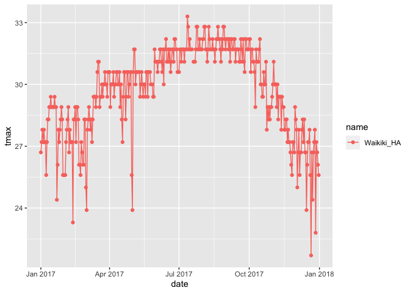<!-- -->

``` r
#if we want to use one whole data set in geom_point and one whole other data set in geom_line, we can do this:
ggplot(data = waikiki, aes(x = date, y = tmax, color = name)) + 
  geom_point() + 
  geom_line(data = central_park)
```

    ## Warning: Removed 3 rows containing missing values (geom_point).

<!-- -->

## `patchwork`

refer back to facet, which creating the exact same plot in the different
panel, the same aes mapping and geoms to create for different
categories.

``` r
weather_df %>% 
  ggplot(aes(x = tmin, fill = name)) +
  geom_density(alpha = 0.5) +
  facet_grid(. ~ name) # no rows, and have columns according to name
```

    ## Warning: Removed 15 rows containing non-finite values (stat_density).

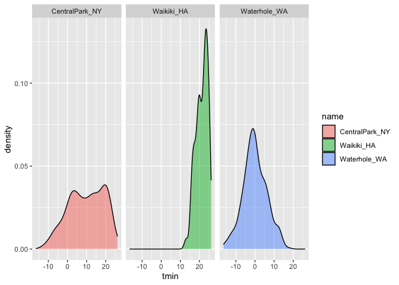<!-- -->

if we want to put a density plot aside of a plotting–&gt; when we want
multi-panel plot but cannot facet, patchwork

``` r
tmax_tmin_p =
  weather_df %>% 
    ggplot(aes(x = tmin, y = tmax, color = name)) +
    geom_point(alpha = .5) +
    theme(legend.position = "none")

prcp_dens_p = 
  weather_df %>% 
  filter(prcp > 0) %>% # to get a better graph, we have to know to use the days with precipitation
  ggplot(aes(x = prcp, fill = name)) + #fill the density plot according to name
  geom_density(alpha = .5) +
  theme(legend.position = "none")

tmax_date_p = 
  weather_df %>% 
  ggplot(aes(x = date, y = tmax, color = name)) +
  geom_point() +
  geom_smooth(se = FALSE) + #standard error is false
  theme(legend.position = "none")
```

now we put all those plot together to a multi-panel plot

``` r
# 3 panel side by side
#tmax_tmin_p + prcp_dens_p + tmax_date_p

#put the last two together
#tmax_tmin_p + (prcp_dens_p + tmax_date_p)

#one on top, next two on bottom
#tmax_tmin_p / (prcp_dens_p + tmax_date_p)

(tmax_tmin_p + prcp_dens_p) / tmax_date_p
```

    ## Warning: Removed 15 rows containing missing values (geom_point).

    ## `geom_smooth()` using method = 'loess' and formula 'y ~ x'

    ## Warning: Removed 3 rows containing non-finite values (stat_smooth).

    ## Warning: Removed 3 rows containing missing values (geom_point).

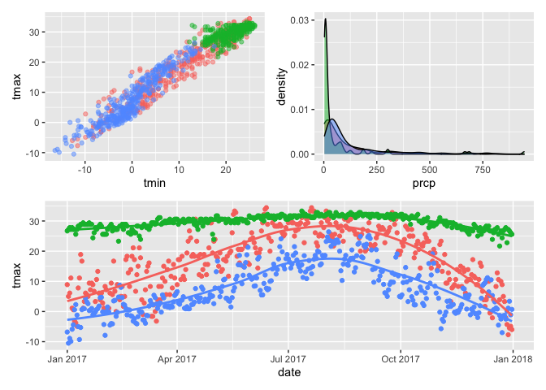<!-- -->

## Data manipulation

``` r
#fill is the proper term to use here instead of color
weather_df %>% 
  ggplot(aes(x = name, y = tmax, fill = name)) +
  geom_violin(alpha = .5)
```

    ## Warning: Removed 3 rows containing non-finite values (stat_ydensity).

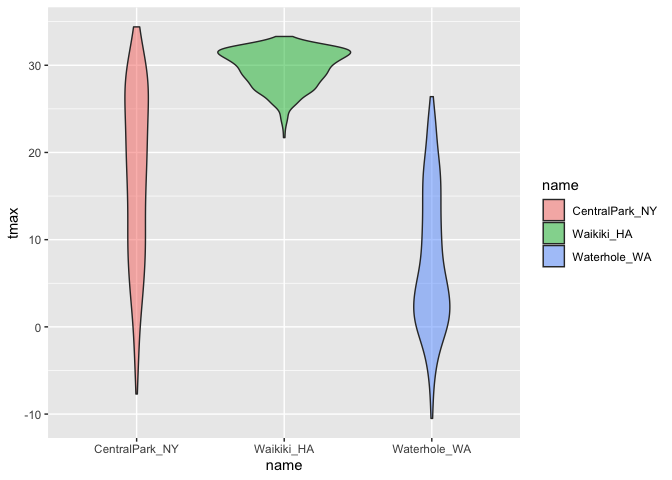<!-- -->

``` r
## ggplot is taking the categorical variable name, change it from a character to a factor, which takes character+numer, such as 1central park, 2waikiki, etc. To put them in different order, don't go into ggplot to change them, we need to know that we want them to be factors and put them in the order we want. That is, we need to manipulate our data differently, using factors to change their order. The key note here is that changing the order of the three "names" is a data manipulation problem not a gg plot problem
```

Fix the order: control your factors

``` r
weather_df %>% 
  mutate(
    name = factor(name),
    # this assumes alphabetic order, cp1, waikiki2, waterhole3, which is what ggplot will do even if we don't mutate the variable like this here
    name = forcats::fct_relevel(name, c("Waikiki_HA"))
    # relevel that waikiki is first and everything else is correct
  ) %>% 
  ggplot(aes(x = name, y = tmax, fill = name)) +
  geom_violin(alpha = .5)
```

    ## Warning: Removed 3 rows containing non-finite values (stat_ydensity).

<!-- -->

what if we want densities for tmin and tmax simultaneously?

``` r
  weather_df %>% 
  filter(name == "CentralPark_NY") %>% 
  #convoluted because if we want to show both tmax and tmin, but they are both varibales, so this becomes a tidy problem, we need to make tmax and tmin to rows
  pivot_longer(
    tmax:tmin,
    names_to = "observation",
    values_to = "temperatures"
  ) %>% 
  ggplot(aes(x = temperatures, fill = observation)) +
  geom_density(alpha = .5) 
```

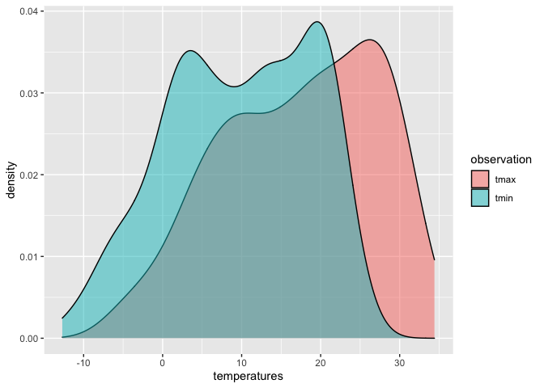<!-- -->

``` r
#This gives us a temperature distribution for tmax and a temperature distribution for tmin
```

``` r
weather_df %>% 
  pivot_longer(
    tmax:tmin,
    names_to = "observation",
    values_to = "temperatures"
  ) %>% 
  ggplot(aes(x = temperatures, fill = observation)) +
  geom_density(alpha = .5) + 
  facet_grid(. ~ name)
```

    ## Warning: Removed 18 rows containing non-finite values (stat_density).

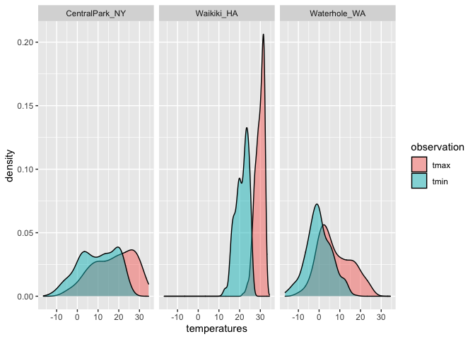<!-- -->

## Revisit the plots

data from the FAS study

``` r
pups_df = 
  read_csv("data/FAS_pups.csv") %>% 
  janitor::clean_names() %>% 
  mutate(sex = recode(sex, `1` = "male", `2` = "female"))
```

    ## Rows: 313 Columns: 6

    ## ── Column specification ────────────────────────────────────────────────────────
    ## Delimiter: ","
    ## chr (1): Litter Number
    ## dbl (5): Sex, PD ears, PD eyes, PD pivot, PD walk

    ## 
    ## ℹ Use `spec()` to retrieve the full column specification for this data.
    ## ℹ Specify the column types or set `show_col_types = FALSE` to quiet this message.

``` r
litters_df = 
  read_csv("data/FAS_litters.csv") %>% 
  janitor::clean_names() %>% 
  separate(group, into = c("dose","day_of_tx"),sep = 3)
```

    ## Rows: 49 Columns: 8

    ## ── Column specification ────────────────────────────────────────────────────────
    ## Delimiter: ","
    ## chr (2): Group, Litter Number
    ## dbl (6): GD0 weight, GD18 weight, GD of Birth, Pups born alive, Pups dead @ ...

    ## 
    ## ℹ Use `spec()` to retrieve the full column specification for this data.
    ## ℹ Specify the column types or set `show_col_types = FALSE` to quiet this message.

``` r
fas_df = left_join(pups_df, litters_df, by = "litter_number")


fas_df %>% 
  select(dose,day_of_tx, starts_with("pd_")) %>% 
  pivot_longer(
    pd_ears:pd_walk,
    names_to = "outcome",
    values_to = "pn_day"
  ) %>% 
  drop_na() %>% 
  mutate(outcome = forcats::fct_relevel(outcome, "pd_ears","pd_pivot","pd_walk","pd_eyes")) %>% 
  ggplot(aes(x = dose, y = pn_day)) + 
  geom_violin() + 
  facet_grid(day_of_tx ~ outcome) #day of treatment against the variable that I'm interested in 
```

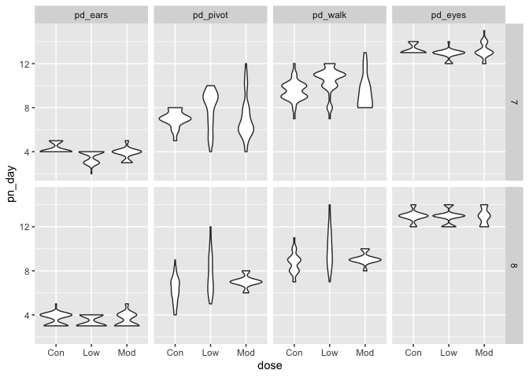<!-- -->
